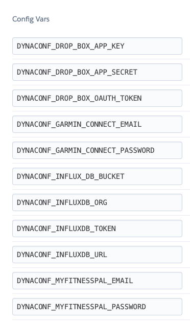

# Health Exporter

Export all your health and lifting metrics to InfluxDB so you can make some pretty graphs on Grafana. At the moment it supports 
- MyFitnessPal
- Repcount
- Garmin **WIP**
- Google Fit **WIP**


## Local Installation
1.  Create a virtualenv

2. Install required packages
```bash
pip install -r requirements.txt
```
3. Use the included `settings.py` file included to create and fill out a `settings.local.py` file in the repo root. This file is untracked and should contain all your credentials. Use environment variables if you're precious about your credentials being in plain text. 

4. Run the thing
```python
python main.py
```

## Hosting
I use InfluxDB cloud, Grafana Cloud and Heroku because it runs fine on free tier on all of them. There's a procfile included. If you're running it on a cloud thing somewhere you'll need to export your env vars with the `DYNACONF` prefix like so 




## License
[MIT](https://choosealicense.com/licenses/mit/)
